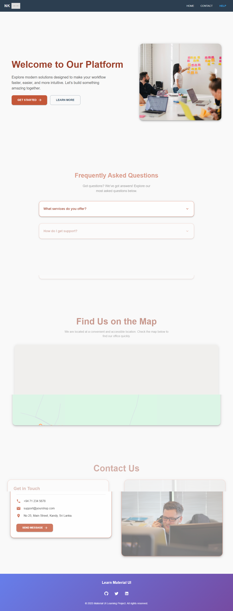
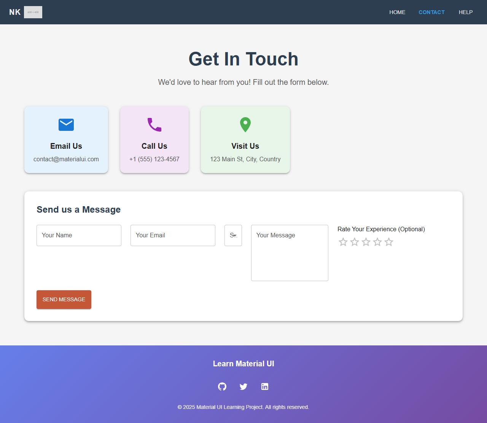

# React Material-UI Project

A modern web application built with **React**, **Material-UI (MUI)**, **JavaScript**, and **Vite**. This project serves as a practice ground for mastering Material-UI components and building responsive, beautifully designed user interfaces.

## 🎯 Project Overview

This is a practice project designed to explore and implement:
- **React 19** - Modern React with latest features
- **Material-UI (MUI 7)** - Comprehensive UI component library
- **Vite** - Lightning-fast build tool and dev server
- **Tailwind CSS** - Utility-first CSS framework
- **React Router DOM** - Client-side routing
- **Framer Motion** - Smooth animations
- **React Slick** - Carousel functionality
- **ESLint** - Code quality and consistency

## 📋 Features

- ✨ Beautiful Material-UI components
- 🎨 Responsive design with Tailwind CSS
- 🔀 Client-side routing with React Router
- ⚡ Fast development with Vite
- 🎬 Smooth animations with Framer Motion
- 📱 Mobile-friendly UI
- 🧩 Reusable component structure
- 🎯 Custom themed components

## 🛠️ Tech Stack

| Technology | Version | Purpose |
|-----------|---------|---------|
| React | ^19.2.0 | UI library |
| Vite | ^7.2.4 | Build tool & dev server |
| Material-UI | ^7.3.5 | UI component library |
| Tailwind CSS | ^4.1.17 | Styling |
| React Router DOM | ^7.9.6 | Routing |
| Framer Motion | ^12.23.24 | Animations |
| React Slick | ^0.31.0 | Carousel |
| Emotion | ^11.14.0 | CSS-in-JS |
| ESLint | ^9.39.1 | Code linting |

## 📂 Project Structure

```
React_with_Material_UI/
├── public/                 # Static assets
├── src/
│   ├── assets/            # Images and media files
│   ├── component/         # Individual components
│   │   └── Button.jsx
│   ├── components/        # Component collection
│   │   ├── Card.jsx
│   │   ├── ContactCard.jsx
│   │   ├── CustomButton.jsx
│   │   ├── CustomCard.jsx
│   │   ├── Faq.jsx
│   │   ├── Footer.jsx
│   │   ├── Hero.jsx
│   │   ├── Map.jsx
│   │   ├── NavBar.jsx
│   │   └── Test.jsx
│   ├── context/           # React Context
│   │   └── theme.jsx
│   ├── pages/             # Page components
│   │   ├── ContactPage.jsx
│   │   ├── Help.jsx
│   │   └── LandingPage.jsx
│   ├── App.jsx            # Main App component
│   ├── App.css
│   ├── main.jsx           # Entry point
│   └── index.css
├── vite.config.js         # Vite configuration
├── eslint.config.js       # ESLint configuration
├── package.json           # Dependencies
├── index.html             # HTML template
└── README.md              # This file
```

## 🚀 Getting Started

### Prerequisites
- **Node.js** (v14 or higher)
- **npm** or **yarn**

### Installation

1. **Clone the repository:**
   ```bash
   git clone <repository-url>
   cd React_with_Material_UI
   ```

2. **Install dependencies:**
   ```bash
   npm install
   ```

3. **Start the development server:**
   ```bash
   npm run dev
   ```

   The application will be available at `http://localhost:5173`

## 📜 Available Scripts

- **`npm run dev`** - Start the development server with hot reload
- **`npm run build`** - Build the project for production
- **`npm run lint`** - Run ESLint to check code quality
- **`npm run preview`** - Preview the production build locally

## 🎨 Key Components

### Pages
- **LandingPage** - Main landing page with hero section
- **ContactPage** - Contact form and information
- **Help** - FAQ and help information

### Components
- **NavBar** - Navigation component
- **Hero** - Hero section with banner
- **Card** - Reusable card component
- **CustomCard** - Customized Material-UI card
- **CustomButton** - Custom button component
- **ContactCard** - Contact information card
- **Footer** - Footer component
- **Faq** - FAQ accordion component
- **Map** - Map integration component

### Context
- **Theme Context** - Global theme management

## 🎬 Screenshots

### Screenshot 1


### Screenshot 2


### Screenshot 3


## 🧠 Learning Objectives

This project was created to practice and master:

1. **Material-UI Components** - Implementing various MUI components like Button, Card, TextField, Dialog, etc.
2. **Responsive Design** - Creating mobile-first, responsive layouts
3. **React Patterns** - Using hooks, context, and component composition
4. **Styling** - Combining Material-UI theming with Tailwind CSS
5. **Vite Setup** - Understanding modern build tools and HMR (Hot Module Replacement)
6. **Animations** - Implementing smooth transitions with Framer Motion
7. **Routing** - Building multi-page applications with React Router
8. **Code Quality** - Using ESLint for consistent code style

## 🎯 What's Included

✅ Responsive navbar with Material-UI  
✅ Custom styled buttons and cards  
✅ Contact form with validation  
✅ FAQ accordion component  
✅ Image carousel with React Slick  
✅ Interactive animations  
✅ Theme system with React Context  
✅ Modern development setup with Vite  
✅ ESLint configuration for code quality  

## 🔧 Configuration

### Vite Configuration
Configured in `vite.config.js` with React plugin for fast HMR and optimal builds.

### ESLint Configuration
Configured in `eslint.config.js` with React and React Hooks rules for code consistency.

### Material-UI Theming
Theme configuration is handled through the `context/theme.jsx` for global style management.

## 💡 Tips for Development

- Use Material-UI's `sx` prop for quick styling
- Leverage the theme context for consistent styling across components
- Take advantage of Vite's HMR for instant feedback
- Follow the component structure for better organization
- Use Tailwind CSS utility classes alongside Material-UI components

## 📚 Resources

- [Material-UI Documentation](https://mui.com/)
- [React Documentation](https://react.dev/)
- [Vite Documentation](https://vitejs.dev/)
- [Tailwind CSS Documentation](https://tailwindcss.com/)
- [React Router Documentation](https://reactrouter.com/)
- [Framer Motion Documentation](https://www.framer.com/motion/)

## 🤝 Contributing

This is a personal practice project, but feel free to fork it and create your own variations!

## 📝 License

This project is open source and available under the MIT License.

## 👤 Author

Created as a practice project for learning React with Material-UI, JavaScript, and Vite.

---

**Happy coding! 🚀**
